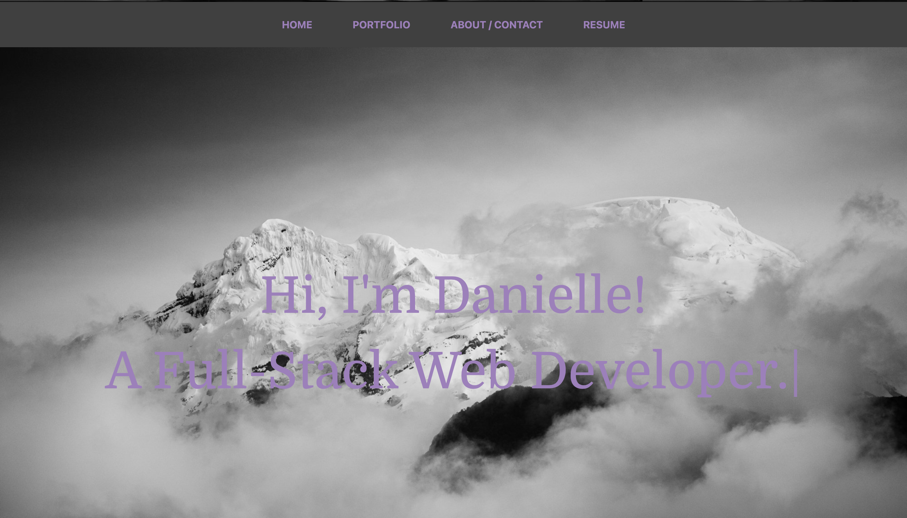

<h1 align="center"> React Portfolio 👋 </h1> 

  ## Description

 This app was built using React.js. An updated version of my personal portfolio using react. This portfolio is responsive using the bootstrap library and css file. I wanted to create an updated portfolio to showcase some of my skills as a new full-stack web developer. Click the link below to view the website.

 [Heroku Deployed App](https://danioportfolio.herokuapp.com/)

  ## Table of Contents

  * [Description](#Description)
  * [Usage](#Usage)
  * [Tech Used](#tech-used)
  * [License](#License)
  * [Questions](#Questions)

  ## Usage

  

  - Once the site loads, you can scroll down to view a few of my featured projects. Then you can navigate through the site with the Navbar.  

  
  ## Tech Used

  - React
  - Node
  - Heroku
  - Npm packages
  
  ## Questions

  Please visit my 
   [GitHub profile](https://github.com/dorley1993/) to check out this and other projects I've created and contributed too.

   Another way to get ahold of me is my email, to find it visit my main dashboard.

  ## License  

    Copyright © Danielle Orley 

    licensed under MIT